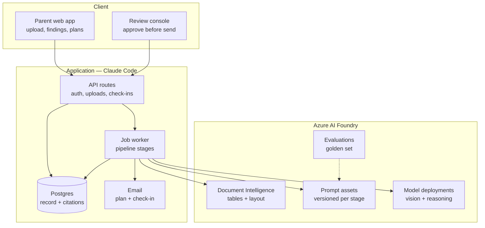

# NurtureOS — High Level Design

**Source:** `docs/PRD.md` (Weeks 1–4)
**Scope:** MVP — segment C, one template family, six model-backed components
**Last updated:** 23 August 2026

---

## 1. Decisions and assumptions

Stated up front so they can be overruled cheaply.

| Decision | Choice | Basis |
|---|---|---|
| Frontend + backend | Next.js 14 App Router, TypeScript, built in Claude Code | Directed |
| Prompts and models | **Azure AI Foundry** — prompt assets and model deployments | Directed |
| Document pre-pass | Azure AI Document Intelligence | Table-heavy PDFs; layout extraction before the vision model |
| Database, auth, storage | Supabase (Postgres + Auth + Storage + RLS) | Project guide default; RLS maps directly onto per-family isolation |
| Long-running work | Postgres-backed job queue (`pg-boss`) with a container worker | Pipeline exceeds serverless timeouts |
| Email | Transactional provider with templating (Resend or Azure Communication Services) | PRD requires the plan and check-in to live in the email body |

### Two PRD conflicts resolved here

**Conflict 1 — 100% human review versus ≤90s time-to-first-insight.** These cannot both hold for a parent sitting and waiting. **Resolution: MVP is asynchronous.** The parent uploads and leaves; the pipeline runs on a queue; you review; findings arrive by email. At ten families and two or three uploads per child per year, that is roughly thirty reviews across the whole MVP — trivially achievable within hours. The 90-second budget and the streaming requirement return at Launch when review drops to sampling.

**Consequence:** "Streaming output" is *not* a model requirement at MVP. It becomes one at Launch. This materially simplifies the MVP architecture — no SSE, no partial rendering, no perceived-latency staging.

**Conflict 2 — prompts live outside the repo.** Foundry holds prompt assets, so a prompt change is not a git commit, and the PRD's "regression on every prompt change, in CI" has nothing to hook onto. **Resolution: prompt versions are pinned in application config.** The app never resolves "latest". Bumping a pinned version is a pull request, which is what triggers the eval run. Foundry is the authoring and evaluation environment; git remains the deployment gate.

---

## 2. Architecture



**Boundary that matters:** the worker is the only thing that talks to Foundry. The web app never calls a model. Every model call is a queued job with a persisted input, output, prompt version and deployment name — which is what makes the PRD's traceability requirement (FR-9.4) fall out of the architecture rather than needing to be added.

---

## 3. The Azure AI Foundry layer

### Prompt assets

One asset per component, versioned in Foundry:

| Asset | Component | Model tier | Output |
|---|---|---|---|
| `extract-report-page` | C2 | Vision, high max output | Typed page record |
| `normalise-observations` | C3 | Reasoning | Skill-code mappings |
| `analyse-record` | C5 | Reasoning, best available | Candidate claims + cited observation ids |
| `corroborate-claim` | C6 | Mid | Verdict enum + supporting quote |
| `synthesise-plan` | C10 | Reasoning | 3 activities + finding ids + resource ids |
| `interpret-checkin` | C13 | Small | Decision enum + rationale |

Shared system-prompt constraints (PRD Week 4) are maintained as a **single Foundry prompt fragment included by every generating asset**, so the non-diagnostic rules are edited in one place. This is the enforcement mechanism for the diagnostic-language gate at MVP, alongside human review.

### Version pinning

```
FOUNDRY_ENDPOINT=...
FOUNDRY_PROMPT_EXTRACT=extract-report-page:7
FOUNDRY_PROMPT_ANALYSE=analyse-record:12
FOUNDRY_DEPLOYMENT_VISION=gpt-4.1-vision-prod
FOUNDRY_DEPLOYMENT_REASONING=gpt-4.1-prod
FOUNDRY_DEPLOYMENT_SMALL=gpt-4.1-mini-prod
```

Every row in `findings` and `plans` stores the exact `prompt_version` and `model_deployment` used. A regression is attributable to a specific change.

### Evaluations

Foundry Evaluations runs the 26-report golden set. Its built-in **groundedness** evaluator covers the PRD's top blocking axis; correctness recall/precision and the HHH safety cases are custom evaluators. CI calls the evaluation run on any PR that changes a pinned prompt version, and fails the build on a blocking axis regression.

---

## 4. Pipeline

Every stage is a queue job. Jobs are idempotent and keyed on `(report_id, stage)` so retries cannot double-write.

| # | Job | Fan-out | Model? |
|---|---|---|---|
| 1 | `report.classify` | — | Yes (MVP 1; MVP assumes one template) |
| 2 | `report.split` | — | No |
| 3 | `page.extract` | **Per page, parallel** | Yes — Doc Intelligence then vision |
| 4 | `report.normalise` | — | Yes |
| 5 | `report.analyse` | — | Yes |
| 6 | `claim.corroborate` | **Per candidate, parallel** | Yes |
| 7 | `report.gate` | — | **No — deterministic** |
| 8 | `review.enqueue` | — | No |
| 9 | `findings.publish` | Human-triggered | No |
| 10 | `plan.generate` → gate → review → send | — | Yes |
| 11 | `checkin.schedule` / `checkin.process` | Fortnightly cron | Yes (small) |

**Report state machine:** `uploaded → classified → extracted → normalised → analysed → gated → in_review → published` with `held` and `failed` as terminal branches.

**Stage 7 is deterministic and load-bearing.** The gate is SQL and TypeScript, not a model:

- **Citation resolution** — every `finding_citations.observation_id` must exist and belong to this report. Unresolvable → finding dropped before it can be displayed.
- **Sufficiency** — count of non-ambiguous observations below threshold → honesty path.
- **Ambiguity** — any trajectory containing a null/dash value is flagged low-confidence and excluded from change claims.

That the groundedness check is a foreign-key join rather than an LLM call is the single most important structural decision in this design.

---

## 5. Data model

Core tables. Every table with family-scoped data carries `family_id` and an RLS policy keyed to the authenticated user.

**Identity and consent**
- `families` · `profiles` (parent, → auth.users) · `children` (family_id, first_name, dob, grade, board, school_id, city, pincode)
- `consents` (family_id, child_id, granted_by, method, verified_at, purposes[], revoked_at) — **no processing without a live row**
- `constraints` (family_id, weekly_minutes, budget_band, radius_km, materials, interests)

**Reports and extraction**
- `schools` · `report_templates` (school_id, board, programme, paradigm A|B|C, status: known|new|unparseable)
- `reports` (child_id, template_id, term_label, academic_year, source_type, storage_path, status, classification_confidence)
- `report_pages` (report_id, page_no, storage_path) — the unit of parallel extraction
- `extractions` (report_id, page_no, raw_json, model_deployment, prompt_version, confidence)

**The normalised record**
- `skills` (code, name, domain, sub_domain) — the ontology
- `skill_aliases` (skill_id, board, raw_label) — the cross-board mapping layer, and the moat
- `observations` (child_id, report_id, skill_id, term_index, raw_value, normalised_value, confidence, **source_ref jsonb**, is_ambiguous)
- `narratives` (report_id, subject, text, source_ref)

`observations.source_ref` holds `{page, table, row, cell}`. It is what lets any displayed value be traced to its origin (FR-3.3) and what the citation check joins against.

**Findings and plans**
- `findings` (child_id, report_id, kind, statement, corroboration_status, status, prompt_version, model_deployment)
- `finding_citations` (finding_id, observation_id | narrative_id, quote) — **the groundedness join**
- `parent_finding_responses` (finding_id, response, note)
- `plans` (child_id, cycle_no, status, prompt_version) · `plan_activities` (plan_id, position, title, instructions, addresses_finding_id, resource_id, place_id, kind)
- `checkins` (plan_id, sent_at, responded_at, q1_done, q2_response, q3_note, decision)

**Reference data — no model involved**
- `curriculum_topics` (board, programme, grade, month, topic) — the syllabus lookup
- `resources` (title, type, url, age_min, age_max, skill_ids[], language, last_validated_at, status)
- `places` (provider_place_id, name, address, phone, hours, lat, lng, verified_at) — MVP 1

**Ops and evaluation**
- `review_queue` (artifact_type, artifact_id, status, reviewer_id, checklist jsonb, violations jsonb)
- `golden_reports` · `golden_labels` (annotator, expected_findings, frozen_at) · `eval_runs` (git_sha, prompt_versions, results)
- `audit_log` (actor, action, entity, entity_id, payload)

---

## 6. API surface

**Parent**
```
POST   /api/children
POST   /api/children/:id/reports        multipart → 202 + report_id
GET    /api/reports/:id/status
GET    /api/children/:id/findings
POST   /api/findings/:id/response       matches | doesnt_match | unsure
GET    /api/children/:id/plans/current
POST   /api/plans/:id/activities/:aid/swap
POST   /api/checkins/:token             tokenised, one-click from email, no session
GET    /api/children/:id/export
DELETE /api/children/:id
```

**Ops**
```
GET    /api/review/queue
GET    /api/review/:id
POST   /api/review/:id/approve          body: checklist
POST   /api/review/:id/reject           body: violation categories
GET    /api/ops/templates               coverage dashboard
```

`/api/checkins/:token` is deliberately sessionless — the PRD requires a check-in answerable in one click from an email. Tokens are single-use, scoped to one check-in, and expire with the cycle.

---

## 7. Review console

Not an afterthought — at MVP it is the enforcement mechanism for a Week 1 hard gate, so it ships in week one of the build.

Per queued artifact it shows the generated output beside its citations, resolving each one back to the source cell, with the six-point checklist as explicit toggles and a rejection taxonomy (diagnostic language, comparison, deficit framing, uncited claim, constraint violation, resource not in library). Rejections write to `review_queue.violations`, which becomes the training set for the Launch-stage classifier.

---

## 8. Security and compliance

| Control | Implementation |
|---|---|
| Per-family isolation | Postgres RLS on every family-scoped table; verified by test (FR-9.2) |
| Consent gate | Pipeline refuses to enqueue without a live `consents` row |
| Report storage | Private bucket, signed URLs, short TTL |
| No training on customer data | Foundry deployments configured with data retention disabled |
| Retention and deletion | Cascade delete across derived records; export endpoint returns the full record |
| SEN decline path | Classification detects IEP/support-plan indicators and halts with an explanatory message rather than analysing |
| Audit | Every model call and every review decision written to `audit_log` |

---

## 9. Folder structure

```
src/
  app/
    (parent)/            upload, findings, plan, history
    (ops)/review/        review console
    api/                 route handlers
  server/
    pipeline/            one module per stage
      classify.ts extract.ts normalise.ts analyse.ts
      corroborate.ts gate.ts plan.ts checkin.ts
    foundry/             client, prompt-version registry, typed responses
    queue/               pg-boss setup, job definitions
    gates/               citation.ts sufficiency.ts ambiguity.ts   ← no model calls
    email/               templates, token handling
  lib/
    ontology/            skill codes, alias mapping
    db/                  schema types, RLS-aware client
worker/                  container entrypoint for the queue
evals/
  golden/                26 reports + frozen labels
  runners/               groundedness, correctness, HHH
supabase/
  migrations/
  rls-policies.sql
```

`src/server/gates/` contains no model calls by design. If a gate ever needs one, the gate has stopped being a gate.

---

## 10. Open items

1. **Email provider** — Resend is simpler; Azure Communication Services keeps everything in one cloud. Either works.
2. **Worker hosting** — Azure Container Apps is the natural fit given Foundry; Fly.io or Railway are cheaper for one container.
3. **Model choice within Foundry** — the deployments above are placeholders. Selection should be made on the golden set, with max output tokens as the disqualifying criterion for Extract (~350 values from 14 pages).
4. **Ontology design** — the largest single design task and the one to do first, since retrofitting `skill_aliases` after the record fills is expensive (PRD C3 risk assessment).
