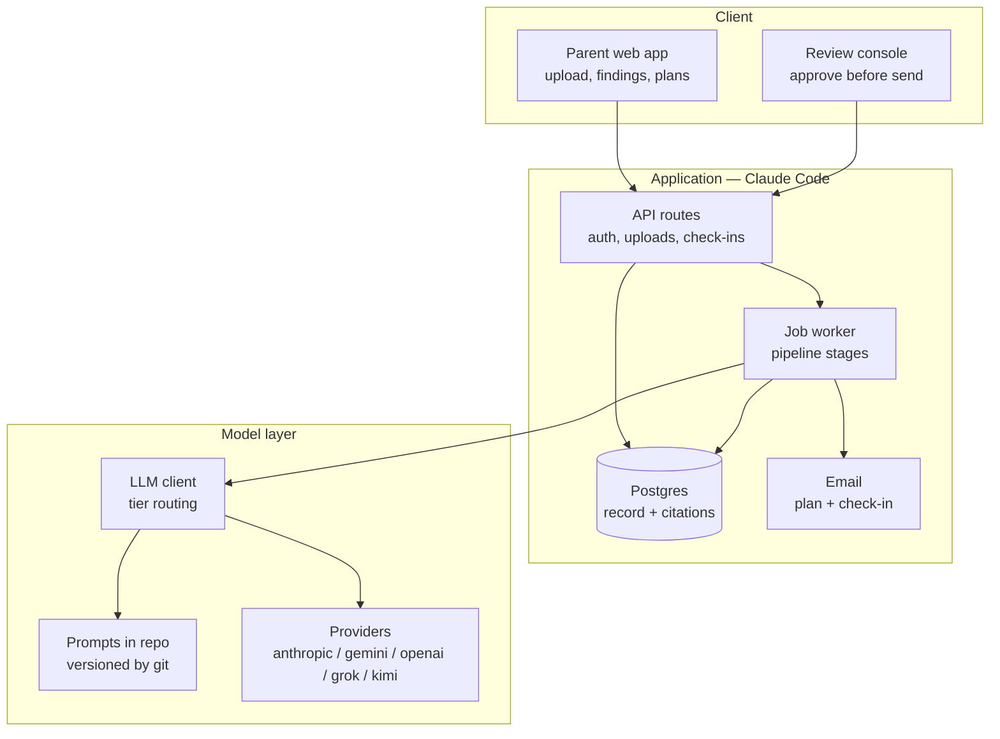

# NurtureOS — High Level Design

**Source:** `docs/PRD.md` (Weeks 1–4)
**Scope:** MVP — segment C, one template family, six model-backed components
**Last updated:** 29 August 2026

---

## 1. Decisions and assumptions

Stated up front so they can be overruled cheaply.

| Decision | Choice | Basis |
|---|---|---|
| Frontend + backend | Next.js 14 App Router, TypeScript, built in Claude Code | Directed |
| Prompts | **In this repository**, TypeScript under `src/server/prompts/`, versions pinned in `version.ts` | A prompt change is a commit, so CI sees it like any other diff |
| Models | **Provider-agnostic, routed per stage** — Anthropic, Gemini, OpenAI, Grok or Kimi, selected by `LLM_*_PROVIDER` | No lock-in; each stage can move independently on evidence |
| Document handling | Native PDF support, no OCR pre-pass | Keeps a standard's label visually joined to its T1/T2/T3 columns |
| Database, auth, storage | Supabase (Postgres + Auth + Storage + RLS) | Project guide default; RLS maps directly onto per-family isolation |
| Long-running work | Postgres-backed job queue (`pg-boss`) with a container worker | Pipeline exceeds serverless timeouts |
| Email | Transactional provider with templating (Resend or Azure Communication Services) | PRD requires the plan and check-in to live in the email body |

### Two PRD conflicts resolved here

**Conflict 1 — 100% human review versus ≤90s time-to-first-insight.** These cannot both hold for a parent sitting and waiting. **Resolution: MVP is asynchronous.** The parent uploads and leaves; the pipeline runs on a queue; you review; findings arrive by email. At ten families and two or three uploads per child per year, that is roughly thirty reviews across the whole MVP — trivially achievable within hours. The 90-second budget and the streaming requirement return at Launch when review drops to sampling.

**Consequence:** "Streaming output" is *not* a model requirement at MVP. It becomes one at Launch. This materially simplifies the MVP architecture — no SSE, no partial rendering, no perceived-latency staging.

**Conflict 2 — prompts outside the repository.** An earlier draft authored prompts in Azure AI Foundry. That made a prompt change something other than a commit, so the PRD's "regression on every prompt change, in CI" had nothing to hook onto, and versions had to be pinned in config purely to force a pull request.

**Resolved by removing the cause.** Prompts are TypeScript modules in `src/server/prompts/`. A prompt change is a diff, reviewed and CI-gated like any other. `version.ts` still pins a version per stage, but now it records *what ran* into `findings.prompt_version` rather than compensating for prompts living elsewhere.

The same move dropped Azure Document Intelligence. Native PDF support sends the document to the model whole, which preserves the visual relationship between a standard's label and its term columns — the structure a separate OCR pass tends to flatten. The cost is that `sourceRef` coordinates become a model claim rather than a geometric measurement; if extraction fidelity misses 98%, a layout pre-pass is the first thing to reinstate.

---

## 2. Architecture



**Boundary that matters:** the worker is the only thing that calls a model. The web app never calls a model. Every model call is a queued job with a persisted input, output, prompt version and deployment name — which is what makes the PRD's traceability requirement (FR-9.4) fall out of the architecture rather than needing to be added.

---

## 3. The model layer

### Prompts

One module per component under `src/server/prompts/`, versioned by git:

| Module | Component | Tier | Output |
|---|---|---|---|
| `extract.ts` | C2 | vision | Typed report record (all pages) |
| `normalise.ts` | C3 | reasoning | Skill-code mappings |
| `analyse.ts` | C5 | reasoning | Candidate claims + cited observation ids |
| `corroborate.ts` | C6 | small | Verdict enum + supporting quote |
| `plan.ts` | C10 | reasoning | 3 activities + finding ids + resource ids |
| `checkin.ts` | C13 | small | Decision enum + rationale |

Shared non-diagnostic constraints (PRD Week 4) live in `constraints.ts` and are composed into every generating prompt, so those rules are edited in one place. Together with 100% human review, that is the enforcement mechanism for the diagnostic-language gate at MVP.

### Tier routing

Stages ask for a capability, never a vendor by default — but each of the six stages can also be pinned to its own provider and model independently, so no two stages are forced onto the same model just because they share a tier. `src/server/llm/client.ts` resolves stage → provider → model at call time, checking a per-stage override before falling back to the tier default.

```
LLM_VISION_PROVIDER=gemini          # tier default for Extract
LLM_REASONING_PROVIDER=gemini       # tier default for Normalise, Analyse, Plan
LLM_SMALL_PROVIDER=openai           # tier default for Corroborate, Check-in

LLM_MODEL_VISION=                   # optional tier-wide model override

LLM_ANALYSE_PROVIDER=openai         # per-stage override — Analyse on a different vendor than Normalise/Plan
LLM_MODEL_ANALYSE=gpt-4o            # per-stage model override
PROMPT_VERSION_EXTRACT=1            # pinned, recorded on every artifact
```

Anthropic and Gemini each use their own SDK for native PDF support. OpenAI, Grok and Kimi share one OpenAI-compatible adapter differing only in base URL and model id. Adding a provider means adding an adapter, not touching a stage.

Every row in `findings` and `plans` stores the `prompt_version` and the resolved `model_deployment`. A regression is attributable to a specific change — and because prompts are in git, that change is a diff.

### Why not a hosted prompt platform

Azure AI Foundry, Bedrock Prompt Management and the hosted eval platforms all move prompts out of the repository. That breaks the PRD's "regression on every prompt change, in CI", because a prompt change stops being a commit. Keeping prompts in git is the cheaper answer and the one that matches how the rest of the system is gated.

What that gives up is hosted evaluation tooling. It matters less here than it looks: the top blocking axis, groundedness, is a foreign-key join rather than a model evaluator. Tracing is the one genuine gap — Langfuse is the obvious later addition, and it is self-hostable and additive, so it would not undo git-versioned prompts.

---

## 4. Pipeline

Every stage is a queue job. Jobs are idempotent and keyed on `(report_id, stage)` so retries cannot double-write.

| # | Job | Fan-out | Model? |
|---|---|---|---|
| 1 | `report.classify` | — | Yes (MVP 1; MVP assumes one template) |
| 2 | `report.extract` | — | Yes — vision tier, native PDF, whole document in one call |
| 3 | `report.normalise` | — | Yes |
| 4 | `report.analyse` — analyse, corroborate, gate, enqueue for review | — | Yes ×2 (analyse, then corroborate per claim) |
| 5 | *review console* — publish or hold | Human-triggered | No |
| 6 | `plan.generate` → enqueue for review → *review console* | — | Yes |
| 7 | `checkin.process` | Per response | Yes (small) |

**Stages 4–6 collapsed from the original design.** `claim.corroborate`, `report.gate` and `review.enqueue` were specified as separate jobs; they run inside `report.analyse` instead. `findings.corroboration_status` is `NOT NULL`, so a finding cannot be written before it has been corroborated — the fan-out would need a completion counter that does not exist. Corroboration is therefore sequential per claim rather than parallel, which is the cost of that simplification and the thing to revisit if analyse gets slow.

**Chaining.** `report.extract` enqueues `report.normalise`, which enqueues `report.analyse`. `report.analyse` ends at `in_review` and enqueues nothing: everything downstream is human-triggered. `plan.generate` has no automatic trigger yet — publishing findings does not start it.

**Report state machine:** `uploaded → extracted → normalised → analysed → in_review → published`, with `held` (reviewer rejected, or honesty path) and `failed` as terminal branches. `classified` and `gated` are not currently used — classify is MVP 1, and the gate is a step inside analyse rather than a state.

**The gate is deterministic and load-bearing.** It is SQL and TypeScript, not a model:

- **Citation resolution** — every `finding_citations.observation_id` must exist and belong to this report. Unresolvable → finding dropped before it can be displayed.
- **Sufficiency** — count of non-ambiguous observations below threshold → honesty path.
- **Ambiguity** — any trajectory containing a null/dash value is flagged low-confidence and excluded from change claims.

That the groundedness check is a foreign-key join rather than an LLM call is the single most important structural decision in this design.

---

## 5. Data model

Core tables. Every table with family-scoped data carries `family_id` and an RLS policy keyed to the authenticated user.

**Identity and consent**
- `families` · `profiles` (parent, → auth.users) · `children` (family_id, first_name, dob, grade, board, school_id, city, pincode)
- `consents` (family_id, child_id, granted_by, method, verified_at, purposes[], revoked_at) — **no processing without a live row**
- `constraints` (family_id, weekly_minutes, budget_band, radius_km, materials, interests)

**Reports and extraction**
- `schools` · `report_templates` (school_id, board, programme, paradigm A|B|C, status: known|new|unparseable)
- `reports` (child_id, template_id, term_label, academic_year, source_type, storage_path, status, classification_confidence)
- `report_pages` (report_id, page_no, storage_path) — **pending migration:** originally the unit of parallel extraction; extraction now runs once per report over the whole document, so this table is only used to store rasterised page images for a provider with no native PDF support (OpenAI, Grok, Kimi — not Anthropic or Gemini)
- `extractions` (report_id, page_no, raw_json, model_deployment, prompt_version, confidence) — **pending migration:** now written once per report, not once per page; `page_no` should become nullable or be dropped when the schema is next revisited

**The normalised record**
- `skills` (code, name, domain, sub_domain) — the ontology
- `skill_aliases` (skill_id, board, raw_label) — the cross-board mapping layer, and the moat
- `observations` (child_id, report_id, skill_id, term_index, raw_value, normalised_value, confidence, **source_ref jsonb**, is_ambiguous)
- `narratives` (report_id, subject, text, source_ref)

`observations.source_ref` holds `{page, table, row, cell}`. It is what lets any displayed value be traced to its origin (FR-3.3) and what the citation check joins against.

**Findings and plans**
- `findings` (child_id, report_id, kind, statement, corroboration_status, status, prompt_version, model_deployment)
- `finding_citations` (finding_id, observation_id | narrative_id, quote) — **the groundedness join**
- `parent_finding_responses` (finding_id, response, note)
- `plans` (child_id, cycle_no, status, prompt_version) · `plan_activities` (plan_id, position, title, instructions, addresses_finding_id, resource_id, place_id, kind)
- `checkins` (plan_id, sent_at, responded_at, q1_done, q2_response, q3_note, decision)

**Reference data — no model involved**
- `curriculum_topics` (board, programme, grade, month, topic) — the syllabus lookup
- `resources` (title, type, url, age_min, age_max, skill_ids[], language, last_validated_at, status)
- `places` (provider_place_id, name, address, phone, hours, lat, lng, verified_at) — MVP 1

**Ops and evaluation**
- `review_queue` (artifact_type, artifact_id, status, reviewer_id, checklist jsonb, violations jsonb)
- `golden_reports` · `golden_labels` (annotator, expected_findings, frozen_at) · `eval_runs` (git_sha, prompt_versions, results)
- `audit_log` (actor, action, entity, entity_id, payload)

---

## 6. API surface

**Parent**
```
POST   /api/children
POST   /api/children/:id/reports        multipart → 202 + report_id
GET    /api/reports/:id/status
GET    /api/children/:id/findings
POST   /api/findings/:id/response       matches | doesnt_match | unsure
GET    /api/children/:id/plans/current
POST   /api/plans/:id/activities/:aid/swap
POST   /api/checkins/:token             tokenised, one-click from email, no session
GET    /api/children/:id/export
DELETE /api/children/:id
```

**Ops**
```
GET    /api/review/queue
GET    /api/review/:id
POST   /api/review/:id/approve          body: checklist
POST   /api/review/:id/reject           body: violation categories
GET    /api/ops/templates               coverage dashboard
```

`/api/checkins/:token` is deliberately sessionless — the PRD requires a check-in answerable in one click from an email. Tokens are single-use, scoped to one check-in, and expire with the cycle.

---

## 7. Review console

Not an afterthought — at MVP it is the enforcement mechanism for a Week 1 hard gate, so it ships in week one of the build.

Per queued artifact it shows the generated output beside its citations, resolving each one back to the source cell, with the six-point checklist as explicit toggles and a rejection taxonomy (diagnostic language, comparison, deficit framing, uncited claim, constraint violation, resource not in library). Rejections write to `review_queue.violations`, which becomes the training set for the Launch-stage classifier.

---

## 8. Security and compliance

| Control | Implementation |
|---|---|
| Per-family isolation | Postgres RLS on every family-scoped table; verified by test (FR-9.2) |
| Consent gate | Pipeline refuses to enqueue without a live `consents` row |
| Report storage | Private bucket, signed URLs, short TTL |
| No training on customer data | Provider accounts configured with zero data retention; no customer data in any training or tuning path |
| Retention and deletion | Cascade delete across derived records; export endpoint returns the full record |
| SEN decline path | Classification detects IEP/support-plan indicators and halts with an explanatory message rather than analysing |
| Audit | Every model call and every review decision written to `audit_log` |

---

## 9. Folder structure

```
src/
  app/
    (parent)/            upload, findings, plan, history
    (ops)/review/        review console
    api/                 route handlers
  server/
    pipeline/            one module per stage
      classify.ts extract.ts normalise.ts analyse.ts
      corroborate.ts gate.ts plan.ts checkin.ts
    foundry/             client, prompt-version registry, typed responses
    queue/               pg-boss setup, job definitions
    gates/               citation.ts sufficiency.ts ambiguity.ts   ← no model calls
    email/               templates, token handling
  lib/
    ontology/            skill codes, alias mapping
    db/                  schema types, RLS-aware client
worker/                  container entrypoint for the queue
evals/
  golden/                26 reports + frozen labels
  runners/               groundedness, correctness, HHH
supabase/
  migrations/
  rls-policies.sql
```

`src/server/gates/` contains no model calls by design. If a gate ever needs one, the gate has stopped being a gate.

---

## 10. Open items

1. **Email provider** — Resend is simpler; Azure Communication Services keeps everything in one cloud. Either works.
2. **Worker hosting** — Fly.io or Railway are the cheapest options for one container; any container host works now that no cloud is load-bearing.
3. **Model choice per tier** — the defaults in `src/server/llm/client.ts` are placeholders. Selection should be made on the golden set, with max output tokens as the disqualifying criterion for Extract (~350 values from 14 pages).
4. **Ontology design** — the largest single design task and the one to do first, since retrofitting `skill_aliases` after the record fills is expensive (PRD C3 risk assessment).
