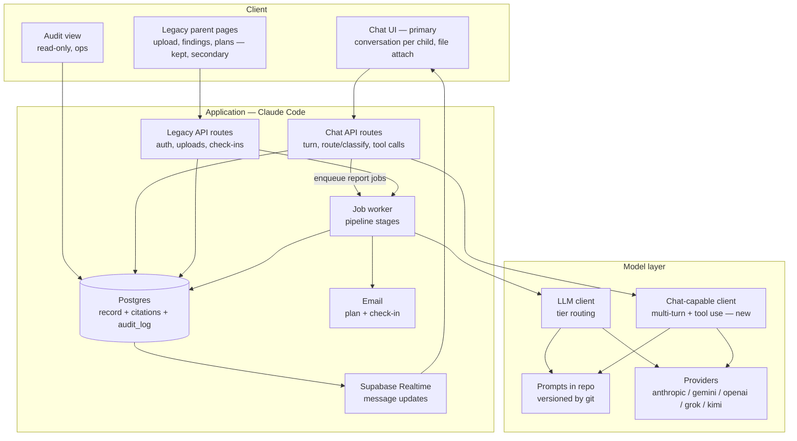

# NurtureOS — High Level Design

**Source:** `docs/PRD.md` (Weeks 1–4) + chat-pivot directive (see §0)
**Scope:** Revision 2 — chat-primary interface, replacing the page-based MVP as the parent's main surface
**Last updated:** 3 October 2026

---

## 0. Pivot: chat replaces the page-based parent flow

Revision 1 of this design (preserved in git history on `archive/pipeline-app-and-review`) built a page-based product: upload → pipeline → findings page (edit/approve) → plan page (request/approve) → check-in. It is fully working and is **not being rebuilt** — this revision keeps every backend piece that doesn't depend on there being a page, and replaces the piece that does.

Three deliberate reversals of the Revision 1 design, directed by the product owner:

1. **Chat is the primary surface.** The parent's main interaction is a conversation thread, not a sequence of pages. `src/app/upload`, `src/app/reports/[id]`, `src/app/plans/[id]`, `src/app/findings/[id]` are kept, untouched, as a secondary/legacy surface — not deleted, not the default entry point, not retrofitted to look like chat.
2. **Chat applies changes directly.** A chat-initiated edit to a finding or a plan is not parked in `draft` waiting for a page visit and a button click — it writes immediately, via a scoped tool call, logged to `audit_log`. This removes the explicit human-approval gate that Revision 1 built findings/plans around (`review_queue`, the approve/reject actions). The audit log is what replaces it as the oversight mechanism — see §7.
3. **Chat may give general advice.** A parent's question can be answered either from the child's own stored data (grounded, cited, same honesty standard as Revision 1) or as general parenting/education knowledge, or both. Revision 1's citation gate and the PRD's "no uncited claim" rule still apply to the grounded path; they do not apply to general advice, which is why the two paths are explicitly routed (§3).

**What this changes architecturally:** Revision 1's one hard boundary — *"the web app never calls a model, only the worker does"* — was correct for a multi-minute, multi-stage report pipeline that would blow a serverless timeout. It does not hold for a chat turn, which has to respond in the same request. This revision adds a second, narrower boundary alongside it (§2): short, single-call model work (a chat turn, an intent classification, a plan regeneration) runs synchronously from the API route; long, multi-stage work (extract → normalise → analyse) stays on the queue exactly as built, and chat surfaces its async nature as a message that updates in place.

---

## 1. Decisions and assumptions

Carried over from Revision 1 unless marked **(new)**.

| Decision | Choice | Basis |
|---|---|---|
| Frontend + backend | Next.js 14 App Router, TypeScript, built in Claude Code | Directed |
| Prompts | In this repository, TypeScript under `src/server/prompts/`, versions pinned in `version.ts` | A prompt change is a commit, so CI sees it like any other diff |
| Models | Provider-agnostic, routed per stage — Anthropic, Gemini, OpenAI, Grok or Kimi, selected by `LLM_*_PROVIDER` | No lock-in; each stage can move independently on evidence |
| Document handling | Native PDF support, no OCR pre-pass | Keeps a standard's label visually joined to its T1/T2/T3 columns |
| Database, auth, storage | Supabase (Postgres + Auth + Storage + RLS) | Project guide default; RLS maps directly onto per-family isolation |
| Long-running work | Postgres-backed job queue (`pg-boss`) with a container worker | Pipeline exceeds serverless timeouts |
| Email | Transactional provider with templating (Resend or Azure Communication Services) | Check-in still lives in an email; chat does not replace email delivery |
| **(new)** Primary UI | Chat thread, one per child | Directed — see §0 |
| **(new)** Chat-initiated writes | Direct, via scoped tool calls + `audit_log`, no approval gate | Directed — see §0 |
| **(new)** Chat model-call boundary | API routes may call the model layer directly for single-call, in-request work (chat turn, routing, plan regeneration); multi-stage report processing stays on the worker queue | Reconciles chat's request/response shape with the existing async pipeline — see §2 |
| **(new)** Grounded vs. general advice | Explicit routing/classification step per turn, not left to one blended prompt | Directed — keeps the citation/honesty gate meaningful for the grounded path without constraining general advice |

### Conflicts resolved in Revision 1 (unchanged)

**100% human review versus ≤90s time-to-first-insight** — resolved by making report processing asynchronous; still true here, since extract/normalise/analyse is unchanged.

**Prompts outside the repository** — resolved by keeping prompts as versioned TypeScript modules; unchanged, and the same applies to the new chat/routing prompts.

### Conflict introduced by this revision, resolved here

**Chat's request/response shape versus "the worker is the only thing that calls a model."** A chat reply has to happen inside the HTTP request that asked for it; a multi-stage report analysis cannot. **Resolution:** split by call shape, not by surface. One model call that returns in a few seconds (chat generation, intent routing, plan regeneration reusing the existing `plan.ts` pipeline module) runs inline in the API route. A chain of model calls over a whole document (extract → normalise → analyse) stays a queued job, unchanged. The chat UI never blocks on the second kind — it posts a placeholder message and the worker updates it in place via Supabase Realtime when the job finishes (§2, §4).

---

## 2. Architecture


```mermaid
flowchart TB
    subgraph client[Client]
        CH[Chat UI — primary<br/>conversation per child, file attach]
        PW[Legacy parent pages<br/>upload, findings, plans — kept, secondary]
        AU[Audit view<br/>read-only, ops]
    end
    subgraph app[Application — Claude Code]
        CAPI[Chat API routes<br/>turn, route/classify, tool calls]
        API[Legacy API routes<br/>auth, uploads, check-ins]
        W[Job worker<br/>pipeline stages]
        DB[(Postgres<br/>record + citations + audit_log)]
        RT[Supabase Realtime<br/>message updates]
        EM[Email<br/>plan + check-in]
    end
    subgraph llm[Model layer]
        LC[LLM client<br/>tier routing]
        LCC[Chat-capable client<br/>multi-turn + tool use — new]
        PR[Prompts in repo<br/>versioned by git]
        PV[Providers<br/>anthropic / gemini / openai / grok / kimi]
    end
    CH --> CAPI
    PW --> API
    AU --> DB
    CAPI --> DB
    CAPI --> LCC
    CAPI -- enqueue report jobs --> W
    API --> DB
    API --> W
    W --> DB
    W --> LC
    LC --> PR & PV
    LCC --> PR & PV
    W --> EM
    DB --> RT --> CH
```

**Two boundaries now, not one.** Multi-stage report processing (extract → normalise → analyse → corroborate) is still worker-only — unchanged from Revision 1, for the same reason (exceeds a request lifetime). Chat API routes are newly allowed to call the model layer directly, but only for calls that complete within a request: a chat turn, the grounded/general routing classification, and plan regeneration (reusing `src/server/pipeline/plan.ts` as a function call instead of a queue job, since it is already a single reasoning-tier call). If a future chat tool needs multi-stage work, it enqueues exactly like report upload does today and the chat thread shows a pending placeholder.

**Every model call is still attributable.** Pipeline-stage calls keep writing `prompt_version` and `model_deployment` as before. Chat turns and tool calls write the same pair into `messages` and into `audit_log`, so "what ran" is traceable either way (§5).

---

## 3. The model layer

### Existing: single-shot pipeline calls (unchanged)

One module per component under `src/server/prompts/`, versioned by git — reused as-is:

| Module | Component | Tier | Output |
|---|---|---|---|
| `extract.ts` | Report extraction | vision | Typed report record (all pages) |
| `normalise.ts` | Skill-code mapping | reasoning | Skill-code mappings |
| `analyse.ts` | Finding generation | reasoning | Candidate claims + cited observation ids |
| `corroborate.ts` | Cross-check vs. narrative | small | Verdict enum + supporting quote |
| `plan.ts` | Plan generation | reasoning | 3+ activities + finding ids + resource ids |
| `checkin.ts` | Check-in decision | small | Decision enum + rationale |

`src/server/llm/client.ts` (`callModel`) is unchanged: one system+user message in, one schema-validated JSON object out, no history, no tools. It stays exactly as built, called from the worker exactly as today.

### New: chat-capable client (multi-turn + tool use)

`callModel` cannot serve chat — it takes no message history and has no concept of a tool call. This revision adds a parallel, chat-specific path rather than retrofitting the pipeline client:

- **New types** alongside `LlmMessage`/`LlmResponse`: a `ChatMessage[]` history (role: user/assistant/tool), a `ToolDefinition[]` (name, JSON-schema input, description), and a `ToolCallResponse` (tool name + arguments, or a final text reply).
- **New provider functions** (one per provider, alongside `callAnthropic`/`callGemini`/`callOpenAICompat`): `callAnthropicChat`, `callGeminiChat`, `callOpenAICompatChat` — same adapters, extended to pass message history and tool definitions through to each SDK's native tool-use support, and to return a tool call when the model makes one.
- **New prompt modules**: `src/server/prompts/chat.ts` (the conversational system prompt — identity, tone, what it can and cannot claim, the general-advice allowance) and `src/server/prompts/chat-route.ts` (the routing/classification prompt, small tier — see below).
- **Tier**: chat turns run on the `reasoning` tier (quality matters for a conversation); routing/classification and tool-argument extraction run on `small` (fast, cheap, structured output only).

### Grounded vs. general-advice routing

A chat turn is handled in two steps, not one blended prompt:

1. **Classify** (`chat-route.ts`, small tier, structured output): does this turn need the child's own data (observations/findings/plans), is it general advice, or both? This is a cheap, schema-validated call — same shape as every existing pipeline call, just fast.
2. **Respond** (`chat.ts`, reasoning tier): generate the reply. If the classifier flagged "grounded," the system prompt requires every claim about the child to carry a citation back to an `observation`/`finding`/`narrative` row — reusing the same citation convention as `finding_citations` — and the response is rejected/retried if it makes an uncited claim about the child (same spirit as `src/server/gates/citation.ts`, applied to a chat reply instead of a `findings` row). If general advice is in scope, that part of the reply carries no such requirement. A single reply may contain both: cited material about the child, plus general guidance, clearly distinguishable to the parent.

### Tool-calling for direct-apply writes

The reasoning-tier chat call is given a small, explicit tool list — not open database access:

| Tool | Does | Backing code (reused) |
|---|---|---|
| `edit_finding_statement` | Reword a finding's statement, keeping the original | `src/server/db/findings.ts` |
| `exclude_finding` / `restore_finding` | Toggle a finding out of/into the active set | `src/server/db/findings.ts` |
| `edit_plan_activity` | Change an activity's title/instructions, or mark it declined | `src/server/db/plans.ts` |
| `regenerate_plan` | Re-run `src/server/pipeline/plan.ts` for the child's current findings | `src/server/pipeline/plan.ts` (single reasoning call, run inline — see §2) |
| `request_report_reanalysis` | Enqueue `report.analyse` again (e.g. after new findings context) | `src/server/queue/enqueue.ts` — this one *does* queue, since analysis is multi-stage |

Every tool call executes the same underlying function the legacy pages already use (no parallel write path, no duplicated validation), then inserts one `audit_log` row (`actor`, `action` = tool name, `entity`/`entity_id`, `payload` = before/after + `conversation_id`/`message_id`). No `review_queue` row is written for a chat-originated change — that table's workflow was *for* the approval gate this revision removes. Legacy-page-originated findings/plans (if a parent still uses the old pages) keep working exactly as before, `review_queue` included.

### Tier routing (unchanged)

`src/server/llm/client.ts` resolves stage → provider → model exactly as in Revision 1; the chat client adds its own `LLM_CHAT_PROVIDER` / `LLM_MODEL_CHAT` and `LLM_CHATROUTE_PROVIDER` / `LLM_MODEL_CHATROUTE` overrides following the identical resolution order (per-call override → tier default → hardcoded default).

---

## 4. Pipeline (unchanged, reused as-is)

Every stage is still a queue job, idempotent and keyed on `(report_id, stage)`:

| # | Job | Fan-out | Model? |
|---|---|---|---|
| 1 | `report.extract` | — | Yes — vision tier, native PDF, whole document in one call |
| 2 | `report.normalise` | — | Yes |
| 3 | `report.analyse` — analyse, corroborate, gate | — | Yes ×2 (analyse, then corroborate per claim) |
| 4 | `plan.generate` | — | Yes (now also callable inline from chat via `regenerate_plan` — see §3) |
| 5 | `checkin.process` | Per response | Yes (small) |

**What changes is not the pipeline — it's what happens after `report.analyse` finishes and after `plan.generate` finishes.** Revision 1 ended both at `in_review`, waiting for a page visit. In this revision:

- The report-attachment path in chat (§6) enqueues `report.extract` exactly as `POST /api/reports` does today — same consent check, same storage, same function. The chat thread gets a "processing your report…" placeholder message when the attachment is accepted.
- When `report.analyse` finishes (worker-side, unchanged code), it writes a `messages` row into the child's conversation (findings summary, with citations) instead of — or in addition to, for the legacy page surface — enqueuing nothing further. Supabase Realtime pushes this to the open chat UI, replacing the placeholder.
- Findings/plans produced this way go straight to `published`/`approved` status (skipping `review_queue`), since there is no longer a page-driven approval step in the primary flow; the `audit_log` entry recording "pipeline published this without review" is what ops can sample (§7).

The gate (`src/server/gates/citation.ts`, `sufficiency.ts`, `trajectory.ts`) is unchanged and still load-bearing: a finding with no resolvable citation still never renders, chat or no chat.

---

## 5. Data model

Everything from Revision 1 is kept (families, profiles, children, consents, reports, observations, narratives, finding_sets, findings, finding_citations, plans, plan_activities, checkins, review_queue, audit_log, reference data). **New, for chat:**

- `conversations` (id, family_id, child_id, created_at) — one per child, per the "per-child" scoping decision; a family with two children has two conversations.
- `messages` (id, conversation_id, family_id, role: `user`|`assistant`|`system`, content text, tool_calls jsonb, tool_results jsonb, attachment_report_id uuid references reports, status: `pending`|`complete`, prompt_version, model_deployment, created_at) — `status = 'pending'` is the placeholder row updated in place when a queued job finishes; `attachment_report_id` links a chat message to the `reports` row it created, reusing the existing upload path rather than inventing a new one.

RLS: both new tables carry `family_id` and follow the exact same `family_read`/`family_write` policy pattern as every other family-scoped table (§8 of Revision 1, unchanged mechanism).

No change is needed to `findings`/`plans`/`plan_activities` to support direct-apply — `artifact_status` already includes `approved`/`published` alongside `draft`/`in_review`; chat-originated writes simply go straight to `approved`/`published` and skip the `review_queue` insert that would otherwise park them at `in_review`.

Stage 2 should confirm the exact current schema against applied migrations (`supabase/migrations/`) before writing the new `supabase-schema.sql` delta — the canonical file in `docs/specs/` predates several since-applied migrations (consent, extraction-whole-report, curriculum phases, parent-edited findings, uncapped plan activities).

---

## 6. Report upload, inside chat

Per the confirmed decision, there is no separate upload page in the primary flow. The parent attaches the report-card file to a chat message. The attachment handler:

1. Resolves the child the conversation belongs to (no `childId` form field needed — it's implicit in which conversation the message was sent to).
2. Runs the exact same consent check, file-type/size validation, storage write and `reports` insert as `src/app/api/reports/route.ts` today — that logic is extracted into a shared function both the legacy upload route and the new chat attachment route call, rather than duplicated.
3. Enqueues `report.extract` exactly as today.
4. Inserts a `pending` placeholder message ("Looking at this report now…") into `messages`, linked via `attachment_report_id`.
5. When `report.analyse` completes, the worker updates that message (or inserts a follow-up) with the findings summary; Realtime pushes it to the open chat.

---

## 7. Audit, in place of the approval gate

Revision 1's `review_queue` + review console enforced the PRD's human-review requirement by blocking publication until a reviewer acted. This revision removes that block for chat-originated writes, by directive (§0). What replaces it as the oversight mechanism:

- Every chat tool call that writes a finding/plan change, every pipeline publish that used to need review, and every legacy-page approval all write to `audit_log` (`actor`, `action`, `entity`, `entity_id`, `payload` with before/after state) — the table already existed in Revision 1 for traceability and is now load-bearing rather than supplementary.
- The ops surface (`src/app/review/*`) becomes a **read-only audit view** over `audit_log`, for sampling and quality oversight — no approve/reject actions, since there is nothing left to approve before the fact. `review_queue` and its actions remain functional only for the legacy page surface, if a parent still uses it.
- This is a real reduction in the pre-publication safety net the PRD originally specified, by explicit product direction, not an oversight — flagged here so it is visible in review rather than buried in a diff.

---

## 8. Security and compliance (unchanged mechanisms, one new row)

| Control | Implementation |
|---|---|
| Per-family isolation | Postgres RLS on every family-scoped table, including the new `conversations`/`messages` | 
| Consent gate | Pipeline refuses to enqueue without a live `consents` row — unchanged, applies to the chat attachment path too |
| Report storage | Private bucket, signed URLs, short TTL — unchanged |
| No training on customer data | Provider accounts configured with zero data retention — applies to chat-tier calls as well as pipeline-tier |
| Retention and deletion | Cascade delete across derived records, now including `conversations`/`messages`; export endpoint returns the full record |
| SEN decline path | Unchanged — classification halts analysis rather than proceeding |
| **(new)** Tool-call scope | Chat tools are an explicit allowlist (§3) operating through existing validated DB functions — the model is never given raw SQL or an unscoped write path |
| Audit | Now the primary oversight mechanism for chat-originated writes, not a supplement to human review (§7) |

---

## 9. Folder structure

```
src/
  app/
    (chat)/              NEW — primary surface: conversation thread, attach, per child
    upload/ reports/ plans/ findings/   legacy pages — kept, untouched, secondary
    review/              now an audit-only view over audit_log
    api/
      chat/              NEW — turn, route/classify, attachments, tool execution
      ...                existing routes, kept (reused internally by chat attachment handler)
  server/
    chat/                NEW — tool definitions, tool dispatch, routing logic
    pipeline/            unchanged: extract.ts normalise.ts analyse.ts corroborate.ts plan.ts checkin.ts
    llm/
      client.ts          unchanged — single-shot pipeline calls
      chat-client.ts     NEW — multi-turn + tool-use calls
      providers/         existing adapters extended with a *Chat variant each
    prompts/             existing six, plus NEW chat.ts and chat-route.ts
    queue/               unchanged
    gates/               unchanged — citation.ts sufficiency.ts trajectory.ts, no model calls
    db/                  existing per-table modules, plus NEW conversations.ts / messages.ts
  lib/
    ontology/            unchanged
    db/                  unchanged
worker/                  unchanged — container entrypoint for the queue
evals/                   unchanged (parked on archive/pipeline-app-and-review pending cherry-pick)
supabase/
  migrations/            NEW migration for conversations/messages + RLS
```

---

## 10. Open items

1. **Tool-calling support per provider.** Anthropic and Gemini have mature native tool-use; the OpenAI-compatible adapter (openai/grok/kimi) needs its tool-call plumbing verified per provider before `LLM_CHAT_PROVIDER` can safely default to any of them.
2. **Latency budget for inline plan regeneration.** `regenerate_plan` running inline (not queued) needs a real number from the golden set — if a reasoning-tier plan call routinely exceeds a few seconds, it needs the same placeholder-message treatment as report processing rather than blocking the chat response.
3. **Rate limiting on direct-apply tools.** Removing the approval gate removes the one place that naturally throttled how fast findings/plans could change; §0's reversal makes this an explicit gap to close before this is production-facing with real families, not an MVP nice-to-have.
4. **Legacy-page decommission timeline.** Not addressed here by directive — the pages stay as a secondary surface until a separate decision to retire them.
5. Everything carried from Revision 1 §10 unchanged: email provider, worker hosting, per-tier model choice, ontology design.
